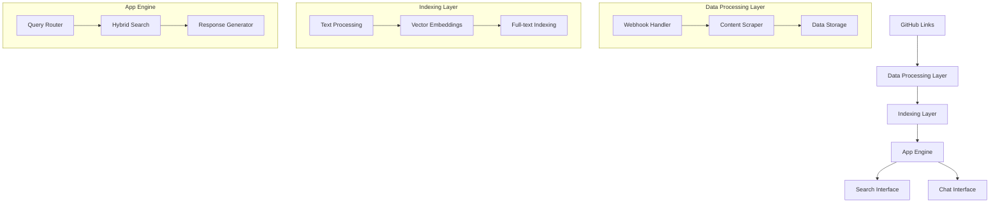
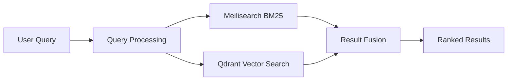
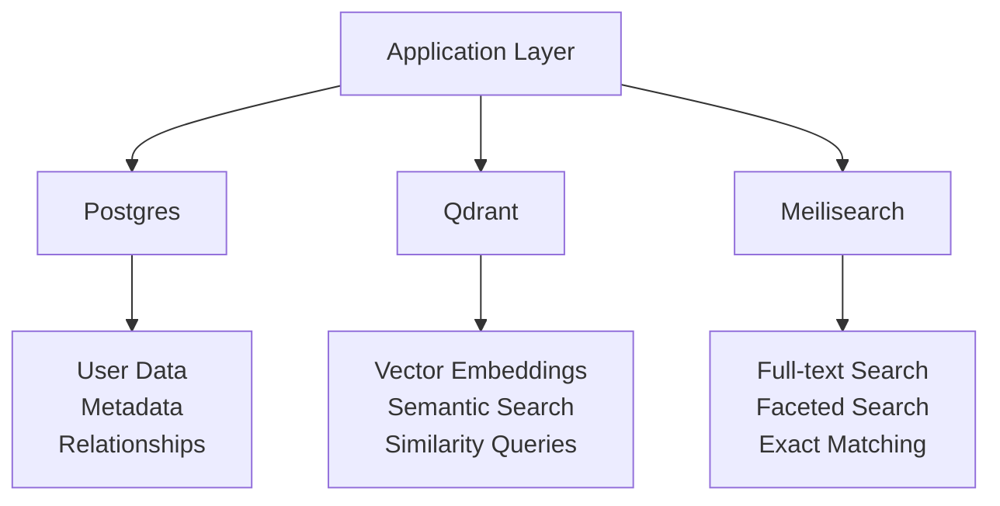
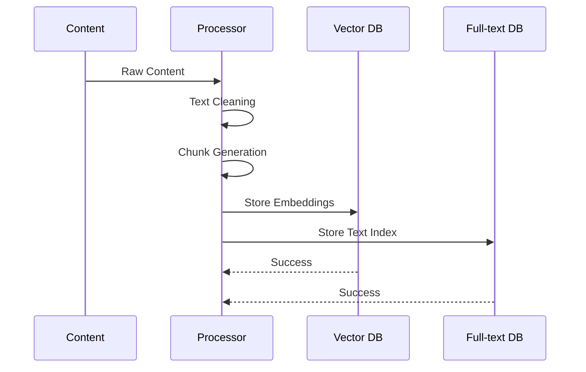
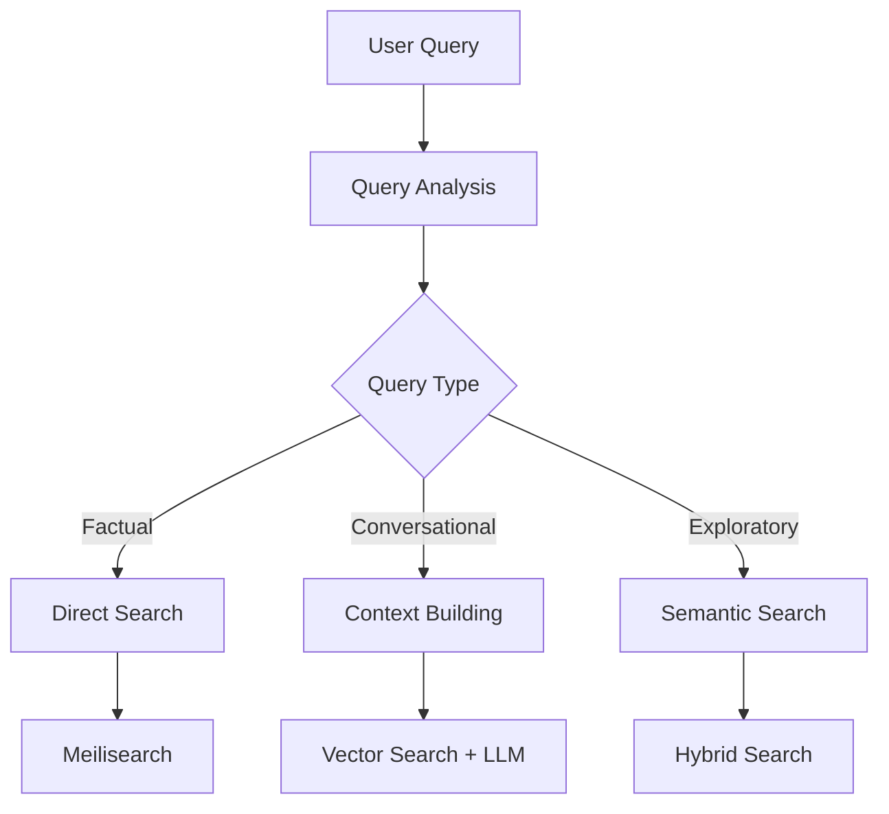
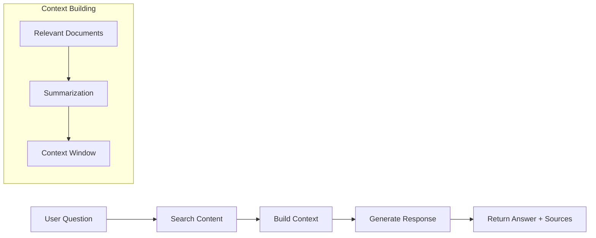

# Building Intelligent Search Systems with LLM-Gym Architecture

*Published: November 2024 • 6 min read*

## Introduction

Modern knowledge management requires more than traditional search - it needs intelligent systems that can understand context, semantics, and user intent. This article explores the architecture of LLM-Gym, a personal project demonstrating how to build sophisticated search and chat systems over curated content.

## System Overview

LLM-Gym implements a three-layer orchestration pattern for intelligent content processing:



## Architecture Patterns

### Hybrid Search Strategy

The system combines two complementary search approaches:



**Benefits of Hybrid Approach:**
- **BM25 (Meilisearch)**: Excellent for exact keyword matching
- **Vector Search (Qdrant)**: Captures semantic similarity
- **Combined Results**: Best of both worlds

### Multi-Database Architecture

```python
# Database specialization
databases = {
    "postgres": "Structured data, relationships",
    "qdrant": "Vector embeddings, semantic search",
    "meilisearch": "Full-text search, faceted search"
}
```

Each database serves its optimal use case:



## Core Components

### Data Processing Layer

Handles incoming data with automated workflows:

```python
class DataProcessor:
    def process_github_webhook(self, payload):
        # Extract content from GitHub links
        content = self.scrape_content(payload.url)
        
        # Store structured data
        self.store_metadata(content)
        
        # Queue for indexing
        self.queue_for_indexing(content)
```

### Indexing Layer

Transforms raw content into searchable formats:



### App Engine

Orchestrates search and chat interactions:

```python
class SearchEngine:
    def hybrid_search(self, query, k=10):
        # Get results from both engines
        vector_results = self.qdrant_search(query, k)
        text_results = self.meilisearch_search(query, k)
        
        # Fusion strategy
        return self.reciprocal_rank_fusion(
            vector_results, 
            text_results
        )
```

## Implementation Highlights

### Containerized Development

```yaml
# docker-compose.yml structure
services:
  app:
    build: .
    depends_on: [postgres, qdrant, meilisearch]
  
  postgres:
    image: postgres:15
    
  qdrant:
    image: qdrant/qdrant
    
  meilisearch:
    image: getmeili/meilisearch
```

### Modern Python Stack

```python
# Key dependencies
dependencies = [
    "dspy-ai",          # LLM framework
    "instructor",       # Structured outputs
    "prisma",          # Database ORM
    "qdrant-client",   # Vector database
    "meilisearch",     # Search engine
]
```

## Semantic Search Implementation

### Embedding Strategy

```python
def create_embeddings(content):
    # Chunk content appropriately
    chunks = self.chunk_content(content)
    
    # Generate embeddings
    embeddings = []
    for chunk in chunks:
        embedding = self.embedding_model.encode(chunk)
        embeddings.append({
            "vector": embedding,
            "metadata": {
                "content": chunk,
                "source": content.url
            }
        })
    
    return embeddings
```

### Query Processing



## Chat Interface Integration

### Context-Aware Responses

```python
class ChatHandler:
    def generate_response(self, query, search_results):
        # Build context from search results
        context = self.build_context(search_results)
        
        # Generate response with LLM
        response = self.llm.generate(
            query=query,
            context=context,
            max_tokens=500
        )
        
        return response
```

### Conversation Flow



## Scaling Considerations

### Performance Optimization

1. **Caching Strategy**: Cache frequent queries and embeddings
2. **Batch Processing**: Process multiple documents efficiently
3. **Async Operations**: Non-blocking I/O for web scraping

### Resource Management

```python
# Configuration for different environments
config = {
    "development": {
        "embedding_batch_size": 10,
        "max_concurrent_requests": 5
    },
    "production": {
        "embedding_batch_size": 100,
        "max_concurrent_requests": 50
    }
}
```

## Best Practices

### 1. Modular Design
Separate concerns with clear interfaces between components.

### 2. Database Specialization
Use the right database for each specific task.

### 3. Hybrid Search
Combine multiple search strategies for better coverage.

### 4. Context Management
Build rich context for LLM responses while managing token limits.

## Conclusion

LLM-Gym demonstrates how to build sophisticated AI-powered search systems using modern architecture patterns. The combination of hybrid search, multi-database architecture, and intelligent context management creates a powerful foundation for knowledge management applications.

Key takeaways: leverage database specialization, implement hybrid search strategies, and design for modularity from the start.

---

*This article is part of my ongoing series on AI engineering. Check out the [writing section](../writing.md) for more articles.*