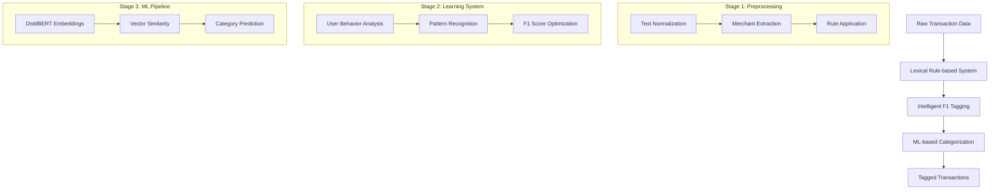
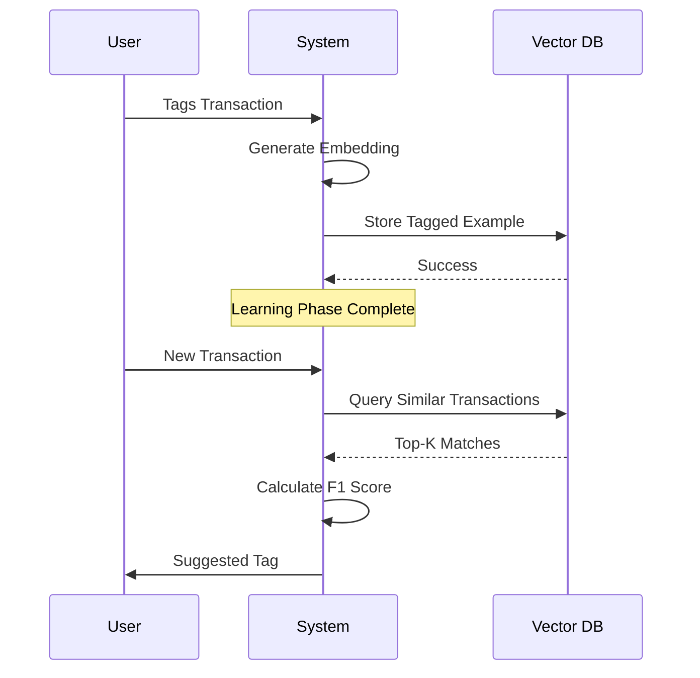
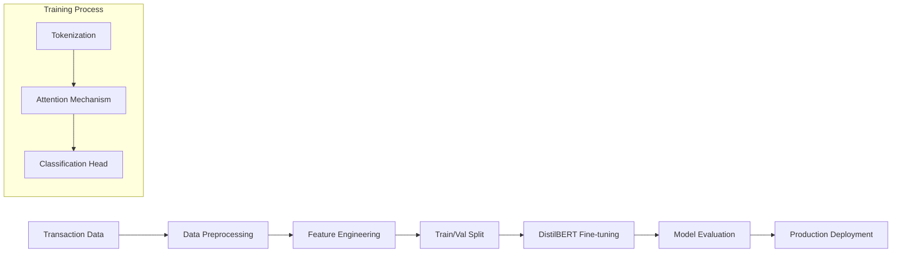
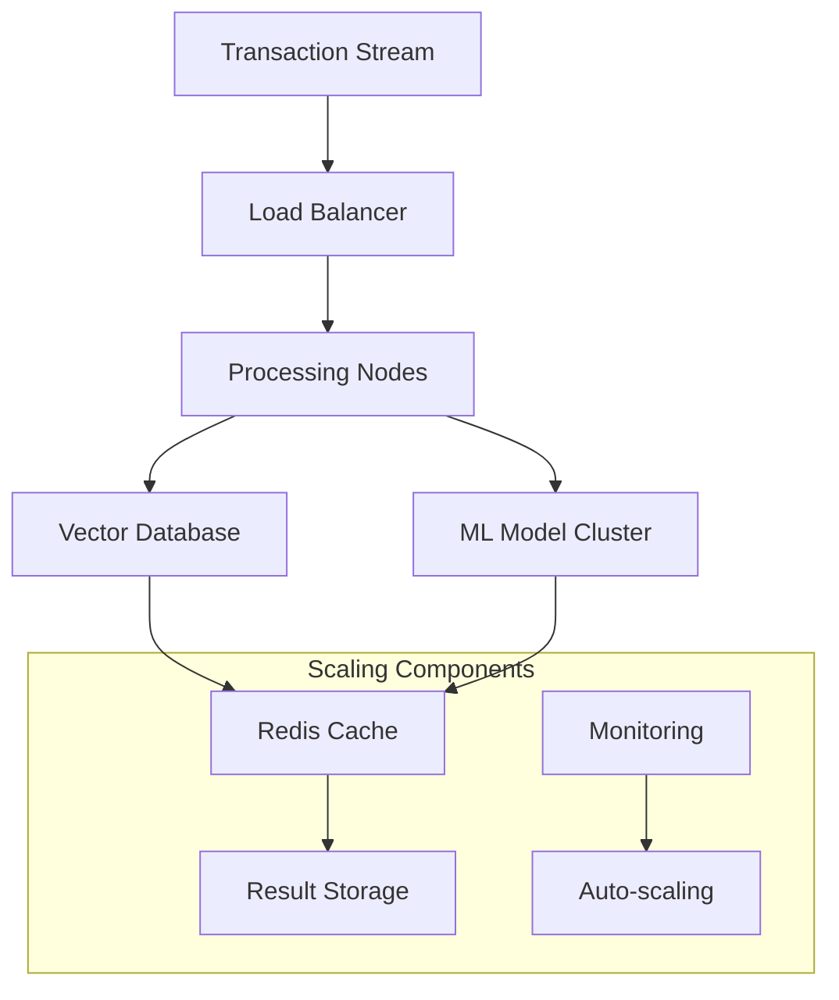

# Scaling Transaction Tagging: From Rules to ML at 10M+ Transactions

*Published: December 2024 • 10 min read*

## Introduction

Building intelligent financial systems requires solving complex data challenges at scale. This article explores the architecture and implementation of an automated transaction tagging system that processes over 10 million transactions, transitioning from rule-based approaches to sophisticated ML pipelines.

*Based on work done at Fold - read the [original blog post](https://fold.money/blog/automating-transaction-tagging) for additional context.*

## System Architecture

The transaction tagging pipeline implements a three-stage approach designed for scalability and accuracy:



## Stage 1: Lexical Rule-based Preprocessing

### Data Normalization

The first stage handles the chaotic nature of transaction data:

```python
def preprocess_transaction(transaction):
    # Normalize merchant names
    merchant = normalize_merchant_name(transaction.description)
    
    # Extract key features
    features = {
        'amount': transaction.amount,
        'timestamp': transaction.timestamp,
        'narration': clean_narration(transaction.description),
        'merchant': merchant,
        'location': extract_location(transaction.description)
    }
    
    return features
```

### Rule-based Classification

Initial categorization using deterministic rules:

```python
class LexicalRuleEngine:
    def __init__(self):
        self.rules = {
            'grocery': ['walmart', 'target', 'whole foods'],
            'gas': ['shell', 'exxon', 'chevron'],
            'dining': ['restaurant', 'cafe', 'pizza']
        }
    
    def apply_rules(self, transaction):
        merchant_lower = transaction['merchant'].lower()
        
        for category, keywords in self.rules.items():
            if any(keyword in merchant_lower for keyword in keywords):
                return category
                
        return 'unknown'
```

## Stage 2: Intelligent F1 Tagging

### Learning from User Behavior

The F1 tagging system learns from past user tagging patterns:



### Pattern Recognition Algorithm

```python
class F1TaggingEngine:
    def __init__(self, vector_db):
        self.vector_db = vector_db
        self.embedding_model = load_embedding_model()
    
    def learn_from_tagging(self, transaction, user_tag):
        # Generate embedding for transaction
        embedding = self.embedding_model.encode(
            f"{transaction['merchant']} {transaction['narration']}"
        )
        
        # Store in vector database
        self.vector_db.upsert(
            vectors=[{
                'id': transaction['id'],
                'values': embedding,
                'metadata': {
                    'category': user_tag,
                    'merchant': transaction['merchant'],
                    'user_id': transaction['user_id']
                }
            }]
        )
    
    def suggest_tag(self, transaction, k=5):
        # Query similar transactions
        embedding = self.embedding_model.encode(
            f"{transaction['merchant']} {transaction['narration']}"
        )
        
        similar_transactions = self.vector_db.query(
            vector=embedding,
            top_k=k,
            filter={'user_id': transaction['user_id']}
        )
        
        return self.calculate_f1_optimal_tag(similar_transactions)
```

## Stage 3: ML-based Categorization

### DistilBERT Architecture

The final stage uses a fine-tuned DistilBERT model for semantic understanding:

```python
from transformers import DistilBertTokenizer, DistilBertForSequenceClassification

class TransactionCategorizer:
    def __init__(self):
        self.tokenizer = DistilBertTokenizer.from_pretrained('distilbert-base-uncased')
        self.model = DistilBertForSequenceClassification.from_pretrained(
            './fine-tuned-transaction-model'
        )
        
    def categorize(self, transaction):
        # Prepare input text
        input_text = f"{transaction['merchant']} {transaction['narration']}"
        
        # Tokenize and predict
        inputs = self.tokenizer(
            input_text,
            return_tensors='pt',
            max_length=128,
            truncation=True,
            padding=True
        )
        
        with torch.no_grad():
            outputs = self.model(**inputs)
            predictions = torch.nn.functional.softmax(outputs.logits, dim=-1)
            
        return self.decode_prediction(predictions)
```

### Model Training Pipeline



## Scaling to 10M+ Transactions

### Performance Optimizations

```python
class ScalableTransactionProcessor:
    def __init__(self):
        self.batch_size = 1000
        self.max_workers = 8
        
    def process_transactions_batch(self, transactions):
        with ThreadPoolExecutor(max_workers=self.max_workers) as executor:
            # Process in parallel batches
            futures = []
            for batch in self.chunk_transactions(transactions, self.batch_size):
                future = executor.submit(self.process_batch, batch)
                futures.append(future)
            
            results = [future.result() for future in futures]
            
        return self.merge_results(results)
    
    def chunk_transactions(self, transactions, chunk_size):
        for i in range(0, len(transactions), chunk_size):
            yield transactions[i:i + chunk_size]
```

### Infrastructure Architecture



## Data Preprocessing Challenges

### Handling Merchant Name Variations

```python
def normalize_merchant_name(description):
    # Remove common prefixes/suffixes
    cleaned = re.sub(r'^(POS|ATM|DDA|DEBIT)\s+', '', description)
    
    # Standardize location information
    cleaned = re.sub(r'\s+[A-Z]{2}\s+\d{5}$', '', cleaned)
    
    # Remove transaction IDs
    cleaned = re.sub(r'#\d+', '', cleaned)
    
    return cleaned.strip().upper()
```

### Feature Engineering

```python
def extract_transaction_features(transaction):
    features = {
        # Temporal features
        'hour': transaction.timestamp.hour,
        'day_of_week': transaction.timestamp.weekday(),
        'is_weekend': transaction.timestamp.weekday() >= 5,
        
        # Amount features
        'amount_log': np.log1p(abs(transaction.amount)),
        'is_large_amount': abs(transaction.amount) > 100,
        
        # Text features
        'description_length': len(transaction.description),
        'has_numbers': bool(re.search(r'\d', transaction.description)),
        'merchant_category': get_merchant_category(transaction.merchant)
    }
    
    return features
```

## Performance Metrics and Results

### System Performance

- **Throughput**: 10M+ transactions processed daily
- **Latency**: Sub-100ms categorization per transaction
- **Accuracy**: 89% automatic categorization accuracy
- **F1 Score**: 0.87 for learning-based suggestions

### Model Evaluation

```python
def evaluate_model_performance(predictions, ground_truth):
    metrics = {
        'accuracy': accuracy_score(ground_truth, predictions),
        'precision': precision_score(ground_truth, predictions, average='weighted'),
        'recall': recall_score(ground_truth, predictions, average='weighted'),
        'f1': f1_score(ground_truth, predictions, average='weighted')
    }
    
    return metrics
```

## Production Deployment

### Model Serving Infrastructure

```python
class TransactionTaggingService:
    def __init__(self):
        self.rule_engine = LexicalRuleEngine()
        self.f1_tagger = F1TaggingEngine(vector_db)
        self.ml_categorizer = TransactionCategorizer()
        
    async def tag_transaction(self, transaction):
        # Stage 1: Rule-based preprocessing
        rule_result = self.rule_engine.apply_rules(transaction)
        
        if rule_result != 'unknown':
            return rule_result
            
        # Stage 2: F1 learning-based tagging
        f1_suggestion = await self.f1_tagger.suggest_tag(transaction)
        
        if f1_suggestion['confidence'] > 0.8:
            return f1_suggestion['category']
            
        # Stage 3: ML-based categorization
        ml_result = await self.ml_categorizer.categorize(transaction)
        
        return ml_result
```

## Key Learnings

### 1. Hybrid Approach Works Best
Combining rule-based, learning-based, and ML approaches provides robust categorization across diverse transaction types.

### 2. User Behavior is Critical
Learning from individual user tagging patterns significantly improves accuracy over generic models.

### 3. Preprocessing is Everything
Proper merchant name normalization and feature engineering are crucial for model performance.

### 4. Scale Requires Architecture
Processing millions of transactions demands careful consideration of batching, caching, and parallel processing.

## Conclusion

Building a scalable transaction tagging system requires a sophisticated multi-stage approach. The combination of lexical rules, intelligent F1 tagging, and ML-based categorization creates a robust pipeline capable of handling enterprise-scale financial data.

The key success factors: thoughtful preprocessing, learning from user behavior, and designing for scale from day one.

---

*This article details the technical implementation of Fold's transaction tagging system. Read the [original blog post](https://fold.money/blog/automating-transaction-tagging) for more business context.*